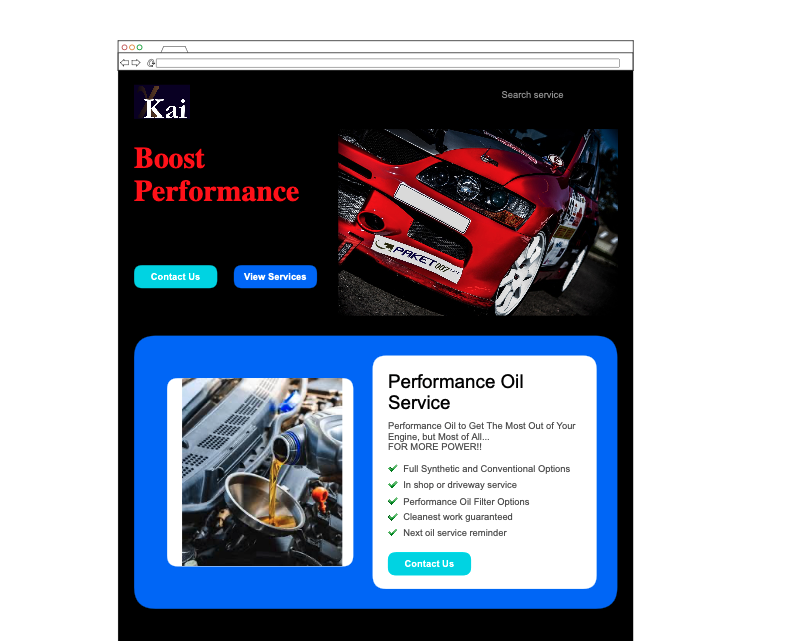
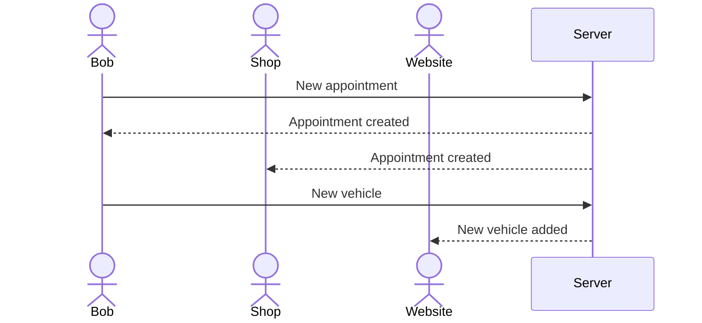

# Tuning Shop Appointment Site/App

[My Notes](notes.md)

A simple appointment making site(app) for a car tuning shop. Users can create an account, create their profile, select service and leave comments. User can find company info, contact and location information.

## 🚀 Specification Deliverable

> [!NOTE]
> Fill in this sections as the submission artifact for this deliverable. You can refer to this [example](https://github.com/webprogramming260/startup-example/blob/main/README.md) for inspiration.

For this deliverable I did the following. I checked the box `[x]` and added a description for things I completed.

- [x] Proper use of Markdown
- [x] A concise and compelling elevator pitch
- [x] Description of key features
- [x] Description of how you will use each technology
- [x] One or more rough sketches of your application. Images must be embedded in this file using Markdown image references.

### Elevator pitch

This is the simplest and yet the most useful car shop site ever. Interface is extremely intuitive and minimum, but the site has every necessary tools to learn about available services, make appoointment for servicing vehicles, thier 2nd greatest assets only to a house. 

### Design

[ninjamock](https://ninjamock.com/s/72C9QZx)

### Key features

The website will have a home page, service page, appointment page, info page, and review page.
- Home page - Promotion and provide easy access to service page and appointment page. Prompt user to create an account or sign in.
- Account manager page - Customize garage, personal information.
- <Service page - Educational information and videos of available services. You can jump to appointment page by choosing a service.>
- Appointment page - You can make an appointment for desired services. 
- Info page - Basic information about the shop/company and contact info.
- <Review page - Form for reviews and claims. Has a space to enter a promotional code to get coupons.>

Special features
- <User can add cars by lisence plate number or manual input.>
- Appointment scheduler displayed in realtime.
- Sends email to user and to the shop on the creation of an appointment.

### Technologies

I am going to use the required technologies in the following ways.

- **HTML** - Uses correct HTML structure for application. Six HTML pages, for home, account manager, service, appointment, info, and review page. Hyperlinks to choice artifact.
- **CSS** - Intuitive UI design and application styling that looks good on different screen sizes, uses good whitespace, color choice and contrast.
- **React** -  Provides login, updating appointment scheduler, updating user's garage, and use of React for routing and components.
- **Service** - Backend service with endpoints for:
  - login
  - retrieving appointment scheduler
  - updating appointment scheduler
  - retrieving garage
  - updating garage
  - Send to the user and to the shop for each appointment. 
- **DB/Login** - Store users, garage, and appointment schedule in database. Register and login users. Credentials securely stored in database. Can't make appointments without being authented.
- **WebSocket** - Schedule gets updated realtime as users make appointment.

## 🚀 AWS deliverable

For this deliverable I did the following. I checked the box `[x]` and added a description for things I completed.

- [x] **Server deployed and accessible with custom domain name** - [My server link](https://yourdomainnamehere.click).

## 🚀 HTML deliverable
[CodePen](https://github.com/Vaoikun/startup) for basic HTML document structure
[CodePen](https://codepen.io/Vaoikun/pen/XJKVmxO) for basic HTML input format

For this deliverable I did the following. I checked the box `[x]` and added a description for things I completed.

- [ ] **HTML pages** - I did not complete this part of the deliverable.
- [ ] **Proper HTML element usage** - I did not complete this part of the deliverable.
- [ ] **Links** - I did not complete this part of the deliverable.
- [ ] **Text** - I did not complete this part of the deliverable.
- [ ] **3rd party API placeholder** - I did not complete this part of the deliverable.
- [ ] **Images** - I did not complete this part of the deliverable.
- [ ] **Login placeholder** - I did not complete this part of the deliverable.
- [ ] **DB data placeholder** - I did not complete this part of the deliverable.
- [ ] **WebSocket placeholder** - I did not complete this part of the deliverable.

## 🚀 CSS deliverable

For this deliverable I did the following. I checked the box `[x]` and added a description for things I completed.

- [ ] **Visually appealing colors and layout. No overflowing elements.** - I did not complete this part of the deliverable.
- [ ] **Use of a CSS framework** - I did not complete this part of the deliverable.
- [ ] **All visual elements styled using CSS** - I did not complete this part of the deliverable.
- [ ] **Responsive to window resizing using flexbox and/or grid display** - I did not complete this part of the deliverable.
- [ ] **Use of a imported font** - I did not complete this part of the deliverable.
- [ ] **Use of different types of selectors including element, class, ID, and pseudo selectors** - I did not complete this part of the deliverable.

## 🚀 React part 1: Routing deliverable

For this deliverable I did the following. I checked the box `[x]` and added a description for things I completed.

- [ ] **Bundled using Vite** - I did not complete this part of the deliverable.
- [ ] **Components** - I did not complete this part of the deliverable.
- [ ] **Router** - I did not complete this part of the deliverable.

## 🚀 React part 2: Reactivity deliverable

For this deliverable I did the following. I checked the box `[x]` and added a description for things I completed.

- [ ] **All functionality implemented or mocked out** - I did not complete this part of the deliverable.
- [ ] **Hooks** - I did not complete this part of the deliverable.

## 🚀 Service deliverable

For this deliverable I did the following. I checked the box `[x]` and added a description for things I completed.

- [ ] **Node.js/Express HTTP service** - I did not complete this part of the deliverable.
- [ ] **Static middleware for frontend** - I did not complete this part of the deliverable.
- [ ] **Calls to third party endpoints** - I did not complete this part of the deliverable.
- [ ] **Backend service endpoints** - I did not complete this part of the deliverable.
- [ ] **Frontend calls service endpoints** - I did not complete this part of the deliverable.
- [ ] **Supports registration, login, logout, and restricted endpoint** - I did not complete this part of the deliverable.

## 🚀 DB deliverable

For this deliverable I did the following. I checked the box `[x]` and added a description for things I completed.

- [ ] **Stores data in MongoDB** - I did not complete this part of the deliverable.
- [ ] **Stores credentials in MongoDB** - I did not complete this part of the deliverable.

## 🚀 WebSocket deliverable

For this deliverable I did the following. I checked the box `[x]` and added a description for things I completed.

- [ ] **Backend listens for WebSocket connection** - I did not complete this part of the deliverable.
- [ ] **Frontend makes WebSocket connection** - I did not complete this part of the deliverable.
- [ ] **Data sent over WebSocket connection** - I did not complete this part of the deliverable.
- [ ] **WebSocket data displayed** - I did not complete this part of the deliverable.
- [ ] **Application is fully functional** - I did not complete this part of the deliverable.
